# ER図（CrossFactor / JRA-VAN DB）

**最終更新:** 2026-03-30  
**出典:** 08_CrossFactor_DB定義書.md  
**対象:** JRA-VAN由来の主要テーブル

---

## 凡例

- `PK` : 主キー（Primary Key）
- `FK` : 外部キー（Foreign Key）
- `NCHAR` / `TEXT` : 文字型
- `INT系` : 数値型
- `FLOAT/REAL` : 小数型

---

## 1. 全体ER図（主要テーブルのリレーション）

```mermaid
erDiagram

    JV開催スケジュール {
        NCHAR 開催年 PK
        NCHAR 開催月日 PK
        NCHAR 競馬場 PK
        NCHAR 開催回 PK
        NCHAR 開催日目 PK
        NCHAR 区分
        NCHAR 作成年月日
        NCHAR 曜日
    }

    JVレース詳細EX {
        TEXT 開催年 PK
        TEXT 開催月日 PK
        TEXT 競馬場 PK
        TEXT 開催回 PK
        TEXT 開催日目 PK
        TEXT 番号 PK
        TEXT 区分
        TEXT 作成年月日
        TEXT 距離
        TEXT 競走種別
        TEXT 天候
        TEXT 芝馬場状態
        TEXT ダ馬場状態
    }

    JV馬毎レース情報EX {
        TEXT 開催年 PK
        TEXT 開催月日 PK
        TEXT 競馬場 PK
        TEXT 開催回 PK
        TEXT 開催日目 PK
        TEXT 番号 PK
        TEXT 馬番 PK
        TEXT 血統登録番号 FK
        TEXT 騎手 FK
        TEXT 調教師 FK
        TEXT 区分
        TEXT 確定着順
        TEXT 異常区分
    }

    JV払戻 {
        NCHAR 開催年 PK
        NCHAR 開催月日 PK
        NCHAR 競馬場 PK
        NCHAR 開催回 PK
        NCHAR 開催日目 PK
        NCHAR 番号 PK
        NCHAR 区分
        TINYINT 登録頭数
        TINYINT 出走頭数
    }

    JV票数 {
        NCHAR 開催年 PK
        NCHAR 開催月日 PK
        NCHAR 競馬場 PK
        NCHAR 開催回 PK
        NCHAR 開催日目 PK
        NCHAR 番号 PK
        NCHAR 区分
        TINYINT 登録頭数
        TINYINT 出走頭数
    }

    JVオッズ_単複枠 {
        NCHAR 開催年 PK
        NCHAR 開催月日 PK
        NCHAR 競馬場 PK
        NCHAR 開催回 PK
        NCHAR 開催日目 PK
        NCHAR 番号 PK
        NCHAR 発表月日時分
        TINYINT 登録頭数
        TINYINT 出走頭数
        NVARCHAR 単勝
        NVARCHAR 複勝
        NVARCHAR 枠連
    }

    JVオッズ_馬連 {
        NCHAR 開催年 PK
        NCHAR 開催月日 PK
        NCHAR 競馬場 PK
        NCHAR 開催回 PK
        NCHAR 開催日目 PK
        NCHAR 番号 PK
        NCHAR 発表月日時分
        TINYINT 登録頭数
        TINYINT 出走頭数
        NVARCHAR 馬連
    }

    JVオッズ_3連複 {
        NCHAR 開催年 PK
        NCHAR 開催月日 PK
        NCHAR 競馬場 PK
        NCHAR 開催回 PK
        NCHAR 開催日目 PK
        NCHAR 番号 PK
        NCHAR 発表月日時分
        TEXT ３連複
        BIGINT ３連複票数合計
    }

    JVオッズ_3連単 {
        NCHAR 開催年 PK
        NCHAR 開催月日 PK
        NCHAR 競馬場 PK
        NCHAR 開催回 PK
        NCHAR 開催日目 PK
        NCHAR 番号 PK
        NCHAR 発表月日時分
        MEDIUMTEXT ３連単
        BIGINT ３連単票数合計
    }

    JV競走馬マスタ {
        NCHAR 血統登録番号 PK
        NCHAR 区分
        NCHAR 作成年月日
        NCHAR 競走馬抹消区分
        NCHAR 生年月日
        NVARCHAR 馬名
        NCHAR 性別
        NCHAR 品種
        NCHAR 毛色
        NCHAR 馬主 FK
        NCHAR 生産者 FK
        NCHAR 調教師 FK
        NCHAR 父繁殖登録番号 FK
        NCHAR 母繁殖登録番号 FK
    }

    JV騎手マスタ {
        NCHAR 騎手 PK
        NCHAR 区分
        NCHAR 作成年月日
        NCHAR 騎手抹消区分
        NCHAR 生年月日
        NVARCHAR 騎手名
        NVARCHAR 騎手名略称
        NVARCHAR 騎手名欧字
        NCHAR 性別区分
        NCHAR 騎乗資格
        NCHAR 騎手東西所属
        NCHAR 所属調教師 FK
    }

    JV調教師マスタ {
        NCHAR 調教師 PK
        NCHAR 区分
        NCHAR 作成年月日
        NCHAR 調教師抹消区分
        NCHAR 生年月日
        NVARCHAR 調教師名
        NVARCHAR 調教師名略称
        NVARCHAR 調教師名欧字
        NCHAR 性別区分
        NVARCHAR 調教師東西所属
    }

    JV馬主マスタ {
        NCHAR 馬主 PK
        NCHAR 区分
        NCHAR 作成年月日
        NVARCHAR 馬主名_法人各有
        NVARCHAR 馬主名_法人各無
        NVARCHAR 馬主名半角ｶﾅ
        NVARCHAR 服色標示
        BIGINT 本年成績情報_本賞金合計
    }

    JV生産者マスタ {
        NCHAR 生産者 PK
        NCHAR 区分
        NCHAR 作成年月日
        NVARCHAR 生産者名_法人各有
        NVARCHAR 生産者名_法人各無
        NVARCHAR 生産者住所自治省名
        BIGINT 本年成績情報_本賞金合計
    }

    JV繁殖馬マスタ {
        NCHAR 繁殖登録番号 PK
        NCHAR 区分
        NCHAR 作成年月日
        NCHAR 血統登録番号 FK
        NVARCHAR 馬名
        NCHAR 生年
        NCHAR 性別
        NCHAR 品種
        NCHAR 毛色
        NCHAR 父馬繁殖登録番号 FK
        NCHAR 母馬繁殖登録番号 FK
    }

    JV産駒マスタ {
        NCHAR 血統登録番号 PK
        NCHAR 区分
        NCHAR 作成年月日
        NCHAR 生年月日
        NCHAR 性別
        NCHAR 品種
        NCHAR 毛色
        NCHAR 生産者 FK
        NCHAR 父繁殖登録番号 FK
        NCHAR 母繁殖登録番号 FK
    }

    JV坂路調教 {
        NCHAR 調教年月日 PK
        NCHAR 調教時刻 PK
        NCHAR 血統登録番号 PK
        NCHAR 区分
        FLOAT ４合計_800M_0M
        FLOAT _600M_400M
        FLOAT _400M_200M
        FLOAT _200M_0M
    }

    JVウッドチップ調教 {
        TEXT 調教年月日 PK
        TEXT 調教時刻 PK
        TEXT 血統登録番号 PK
        TEXT 区分
        TEXT 馬場周り
        REAL １０合計
        REAL ９合計
    }

    JVコース情報 {
        NCHAR 競馬場 PK
        NCHAR 距離 PK
        NCHAR 区分
        NCHAR 作成年月日
        NCHAR 改修年月日
    }

    JVレコードマスタ {
        NCHAR 開催年 PK
        NCHAR 開催月日 PK
        NCHAR 競馬場 PK
        NCHAR 番号 PK
        NCHAR 識別区分
        NCHAR 距離
        NCHAR 競走種別
        NCHAR 天候
        NCHAR 芝馬場状態
    }

    %% ---- リレーション ----

    %% 開催スケジュール → レース
    JV開催スケジュール ||--o{ JVレース詳細EX : "開催年/月日/場/回/日目"
    JV開催スケジュール ||--o{ JV払戻 : "開催年/月日/場/回/日目"
    JV開催スケジュール ||--o{ JV票数 : "開催年/月日/場/回/日目"
    JV開催スケジュール ||--o{ JVオッズ_単複枠 : "開催年/月日/場/回/日目"
    JV開催スケジュール ||--o{ JVオッズ_馬連 : "開催年/月日/場/回/日目"
    JV開催スケジュール ||--o{ JVオッズ_3連複 : "開催年/月日/場/回/日目"
    JV開催スケジュール ||--o{ JVオッズ_3連単 : "開催年/月日/場/回/日目"
    JV開催スケジュール ||--o{ JVレコードマスタ : "開催年/月日/場"

    %% レース詳細 → 馬毎
    JVレース詳細EX ||--o{ JV馬毎レース情報EX : "レースキー"
    JVレース詳細EX ||--|| JV払戻 : "レースキー"
    JVレース詳細EX ||--|| JV票数 : "レースキー"
    JVレース詳細EX ||--o{ JVオッズ_単複枠 : "レースキー"
    JVレース詳細EX ||--o{ JVオッズ_馬連 : "レースキー"
    JVレース詳細EX ||--o{ JVオッズ_3連複 : "レースキー"
    JVレース詳細EX ||--o{ JVオッズ_3連単 : "レースキー"

    %% 競走馬 → 馬毎・調教
    JV競走馬マスタ ||--o{ JV馬毎レース情報EX : "血統登録番号"
    JV競走馬マスタ ||--o{ JV坂路調教 : "血統登録番号"
    JV競走馬マスタ ||--o{ JVウッドチップ調教 : "血統登録番号"

    %% 騎手 → 馬毎
    JV騎手マスタ ||--o{ JV馬毎レース情報EX : "騎手コード"

    %% 調教師 → 競走馬・騎手
    JV調教師マスタ ||--o{ JV競走馬マスタ : "調教師コード"
    JV調教師マスタ ||--o{ JV騎手マスタ : "所属調教師"

    %% 馬主・生産者 → 競走馬
    JV馬主マスタ ||--o{ JV競走馬マスタ : "馬主コード"
    JV生産者マスタ ||--o{ JV競走馬マスタ : "生産者コード"
    JV生産者マスタ ||--o{ JV産駒マスタ : "生産者コード"

    %% 繁殖馬 → 競走馬・産駒
    JV繁殖馬マスタ ||--o{ JV競走馬マスタ : "父/母繁殖登録番号"
    JV繁殖馬マスタ ||--o{ JV産駒マスタ : "父/母繁殖登録番号"
    JV繁殖馬マスタ ||--o{ JV繁殖馬マスタ : "父馬/母馬（自己参照）"

    %% コース情報
    JVコース情報 ||--o{ JVレース詳細EX : "競馬場コード"
```



---

## 2. AIに使う中心テーブルの簡略図

競馬AI開発で直接使う主要テーブルに絞った構成です。

```mermaid
erDiagram

    レース {
        TEXT レースキー PK
        TEXT 開催年月日
        TEXT 競馬場
        TEXT 距離
        TEXT 競走種別
        TEXT 天候
        TEXT 芝馬場状態
        TEXT ダ馬場状態
    }

    馬毎レース情報 {
        TEXT レースキー PK
        TEXT 馬番 PK
        TEXT 血統登録番号 FK
        TEXT 騎手コード FK
        TEXT 調教師コード FK
        TEXT 確定着順
        TEXT 異常区分コード
        TEXT コーナー通過順位
    }

    競走馬マスタ {
        TEXT 血統登録番号 PK
        TEXT 馬名
        TEXT 性別
        TEXT 生年月日
        TEXT 父繁殖登録番号 FK
        TEXT 母繁殖登録番号 FK
        TEXT 調教師コード FK
        TEXT 馬主コード FK
    }

    騎手マスタ {
        TEXT 騎手コード PK
        TEXT 騎手名
        TEXT 騎乗資格
        TEXT 東西所属
    }

    調教師マスタ {
        TEXT 調教師コード PK
        TEXT 調教師名
        TEXT 東西所属
    }

    坂路調教 {
        TEXT 血統登録番号 PK
        TEXT 調教年月日 PK
        TEXT 調教時刻 PK
        FLOAT 200M
        FLOAT 400M
        FLOAT 600M
        FLOAT 800M合計
    }

    ウッドチップ調教 {
        TEXT 血統登録番号 PK
        TEXT 調教年月日 PK
        TEXT 調教時刻 PK
        REAL ラップ各区間
    }

    オッズ {
        TEXT レースキー PK
        TEXT 発表時刻 PK
        TEXT 単勝オッズ
        TEXT 複勝オッズ
        TEXT 馬連オッズ
        TEXT 3連複オッズ
        TEXT 3連単オッズ
    }

    払戻 {
        TEXT レースキー PK
        TEXT 単勝払戻
        TEXT 複勝払戻
        TEXT 馬連払戻
        TEXT 3連複払戻
        TEXT 3連単払戻
    }

    レース ||--o{ 馬毎レース情報 : "レースキー"
    レース ||--|| オッズ : "レースキー"
    レース ||--|| 払戻 : "レースキー"
    競走馬マスタ ||--o{ 馬毎レース情報 : "血統登録番号"
    競走馬マスタ ||--o{ 坂路調教 : "血統登録番号"
    競走馬マスタ ||--o{ ウッドチップ調教 : "血統登録番号"
    騎手マスタ ||--o{ 馬毎レース情報 : "騎手コード"
    調教師マスタ ||--o{ 馬毎レース情報 : "調教師コード"
    調教師マスタ ||--o{ 競走馬マスタ : "調教師コード"
```

---

## 3. テーブル別 主キー一覧

| テーブル名 | 主キー構成 | 備考 |
|-----------|----------|------|
| JV開催スケジュール | 開催年 + 開催月日 + 競馬場 + 開催回 + 開催日目 | 開催単位 |
| JVレース詳細EX | 上記 + 番号（レース番号） | レース単位 |
| JV馬毎レース情報EX | 上記 + 馬番 | 出走馬単位 |
| JV払戻 | レースキー（開催+番号） | レース単位 |
| JV票数 | レースキー | レース単位 |
| JVオッズ_単複枠 | レースキー + 発表月日時分 | 時点別 |
| JVオッズ_馬連 | レースキー + 発表月日時分 | 時点別 |
| JVオッズ_3連複 | レースキー + 発表月日時分 | 時点別 |
| JVオッズ_3連単 | レースキー + 発表月日時分 | 時点別 |
| JV競走馬マスタ | 血統登録番号 | 馬ID |
| JV騎手マスタ | 騎手コード | 騎手ID |
| JV調教師マスタ | 調教師コード | 調教師ID |
| JV馬主マスタ | 馬主コード | 馬主ID |
| JV生産者マスタ | 生産者コード | 生産者ID |
| JV繁殖馬マスタ | 繁殖登録番号 | 繁殖馬ID |
| JV産駒マスタ | 血統登録番号 | 産駒ID |
| JV坂路調教 | 血統登録番号 + 調教年月日 + 調教時刻 | 調教記録単位 |
| JVウッドチップ調教 | 血統登録番号 + 調教年月日 + 調教時刻 | 調教記録単位 |
| JVコース情報 | 競馬場 + 距離 | コース単位 |
| JVレコードマスタ | 開催年 + 開催月日 + 競馬場 + 番号 | レコード単位 |

---

## 4. AI特徴量生成に使う結合パス

```
馬毎レース情報EX
  ├── JVレース詳細EX        → 距離・馬場・競走種別・天候
  ├── JV競走馬マスタ        → 馬名・性別・血統
  ├── JV騎手マスタ          → 騎手名・騎乗資格・所属
  ├── JV調教師マスタ        → 調教師名・所属
  ├── JV坂路調教            → 直前調教タイム（血統登録番号で結合）
  ├── JVウッドチップ調教    → 直前調教ラップ（血統登録番号で結合）
  └── JVオッズ_単複枠       → 締め切り前単勝オッズ（レースキーで結合）

JV払戻
  └── JVレース詳細EX        → 回収率計算用（正解ラベル）
```
